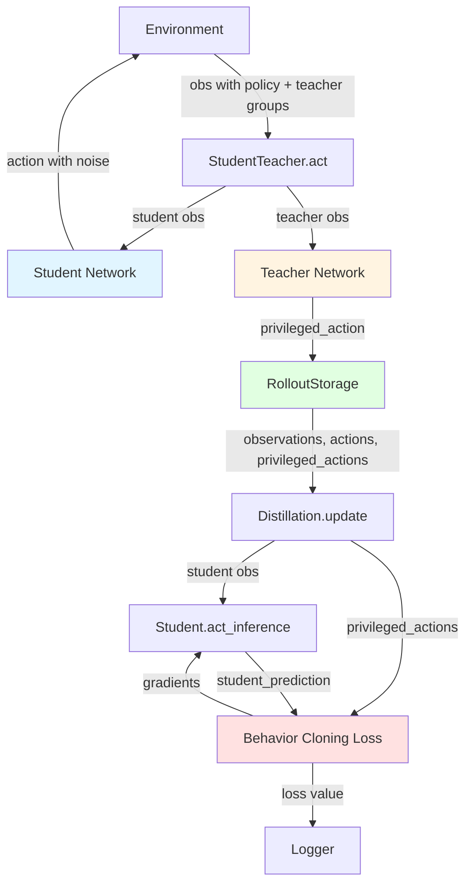

# Student-Teacher Distillation Pipeline

## Overview

The **Student-Teacher Distillation** framework in RSL-RL implements knowledge distillation for robotics policies. This technique allows a **student** policy (with limited observations) to learn from a pre-trained **teacher** policy (with privileged information). The student learns to mimic the teacher's behavior through behavior cloning, enabling transfer of knowledge from privileged to limited observation spaces.

**Key Concept:** The teacher policy has access to privileged information (e.g., ground truth states, internal dynamics) that is not available at deployment, while the student policy must operate with only limited sensor observations.

---

## Architecture Components

The distillation pipeline consists of four main components:

### 1. DistillationRunner

**Location:** [`rsl_rl/runners/distillation_runner.py`](../rsl_rl/runners/distillation_runner.py)

The `DistillationRunner` inherits from `OnPolicyRunner` and orchestrates the training process. It ensures the teacher model is loaded before training begins and configures the observation groups for distillation.

**Key Methods:**

- `learn(num_learning_iterations, init_at_random_ep_len)`: Validates that the teacher is loaded, then executes the training loop
- `_construct_algorithm(obs)`: Constructs the `Distillation` algorithm with `StudentTeacher` or `StudentTeacherRecurrent` policy
- `_get_default_obs_sets()`: Returns `["teacher"]` as the required observation set (in addition to `["policy"]`)

**Code Example:**
```python
class DistillationRunner(OnPolicyRunner):
    """Distillation runner for training and evaluation of teacher-student methods."""

    def learn(self, num_learning_iterations: int, init_at_random_ep_len: bool = False) -> None:
        # Check if teacher is loaded
        if not self.alg.policy.loaded_teacher:
            raise ValueError("Teacher model parameters not loaded. Please load a teacher model to distill.")
        
        super().learn(num_learning_iterations, init_at_random_ep_len)
```

### 2. StudentTeacher Modules

#### StudentTeacher (Feedforward)

**Location:** [`rsl_rl/modules/student_teacher.py`](../rsl_rl/modules/student_teacher.py)

The `StudentTeacher` module contains two separate neural networks:

- **Student Network**: MLP that takes `obs_groups["policy"]` observations and outputs actions
- **Teacher Network**: MLP that takes `obs_groups["teacher"]` (privileged) observations and outputs actions

**Key Features:**
- Separate observation normalizers for student and teacher
- Action noise for exploration during training (configurable as scalar or log-parameterized)
- Teacher always operates in eval mode (frozen, no gradients)

**Key Methods:**

- `act(obs)`: Student samples action with noise (for training)
- `act_inference(obs)`: Student outputs deterministic action (for deployment)
- `evaluate(obs)`: Teacher forward pass (always in eval mode, no gradients)
- `get_student_obs(obs)` / `get_teacher_obs(obs)`: Extract and concatenate observation groups

**Architecture:**
```python
# Student
self.student = MLP(num_student_obs, num_actions, student_hidden_dims, activation)
self.student_obs_normalizer = EmpiricalNormalization(num_student_obs)  # Optional

# Teacher
self.teacher = MLP(num_teacher_obs, num_actions, teacher_hidden_dims, activation)
self.teacher_obs_normalizer = EmpiricalNormalization(num_teacher_obs)  # Optional
```

#### StudentTeacherRecurrent (Recurrent)

**Location:** [`rsl_rl/modules/student_teacher_recurrent.py`](../rsl_rl/modules/student_teacher_recurrent.py)

Similar to `StudentTeacher` but with RNN memory components:

- **Student**: Memory (RNN/LSTM/GRU) → MLP
- **Teacher**: Optional Memory → MLP (if `teacher_recurrent=True`)

**Additional Features:**
- Handles hidden states for both student and teacher networks
- Supports LSTM and GRU architectures
- Can have recurrent student with feedforward teacher, or both recurrent

**Architecture:**
```python
# Student with memory
self.memory_s = Memory(num_student_obs, rnn_hidden_dim, rnn_num_layers, rnn_type)
self.student = MLP(rnn_hidden_dim, num_actions, student_hidden_dims, activation)

# Teacher (optionally recurrent)
if self.teacher_recurrent:
    self.memory_t = Memory(num_teacher_obs, rnn_hidden_dim, rnn_num_layers, rnn_type)
teacher_input_dim = rnn_hidden_dim if self.teacher_recurrent else num_teacher_obs
self.teacher = MLP(teacher_input_dim, num_actions, teacher_hidden_dims, activation)
```

### 3. Distillation Algorithm

**Location:** [`rsl_rl/algorithms/distillation.py`](../rsl_rl/algorithms/distillation.py)

The `Distillation` class implements the behavior cloning loss and manages the training process.

**Training Flow:**

1. **Rollout Phase** (`act()`):
   - Student samples action (with noise) for environment interaction
   - Teacher generates privileged action (stored as target for learning)
   - Both actions stored in transition

2. **Update Phase** (`update()`):
   - Iterates through collected transitions
   - Computes behavior cloning loss: `MSE(student_action, teacher_action)`
   - Updates only student network (teacher remains frozen)

**Key Parameters:**

- `num_learning_epochs`: Number of epochs over collected data
- `gradient_length`: Accumulate gradients over N steps before update
- `loss_type`: "mse" or "huber"
- `max_grad_norm`: Gradient clipping threshold
- `learning_rate`: Learning rate for optimizer

### Distillation Hyperparameters (Detailed)

- `num_learning_epochs`: Number of passes over the stored rollout per update; increasing it reuses data more but can overfit.
- `gradient_length`: Number of time steps to accumulate loss before a backward/optimizer step. With `num_envs` environments, the effective batch per optimizer step is roughly `num_envs * gradient_length`. For recurrent policies, this is also the truncated BPTT window.
- `learning_rate`: Step size given to the optimizer when it is created.
- `optimizer`: Optimizer name resolved by `resolve_optimizer` (`adam`, `adamw`, `sgd`, `rmsprop`).
- `max_grad_norm`: If set, clips gradient norm for the student parameters only (the teacher is always frozen, and the
  recurrent memory parameters are not clipped in the current implementation).
- `loss_type`: `mse` or `huber`. Huber is more robust to outliers.
- `device`: Where the policy and training tensors live (`cpu` or `cuda`).
- `multi_gpu_cfg`: Enables distributed averaging of gradients across GPUs (uses `global_rank` and `world_size`).

**Update step math:** the number of optimizer steps per update is approximately
`floor(num_steps_per_env * num_learning_epochs / gradient_length)` because gradients are applied every
`gradient_length` transitions. If `num_learning_epochs == 1` and `num_steps_per_env` is not divisible by
`gradient_length`, the tail of the rollout does not trigger an optimizer step.

**Code Example:**
```python
def update(self) -> dict[str, float]:
    for epoch in range(self.num_learning_epochs):
        for obs, _, privileged_actions, dones in self.storage.generator():
            # Student forward pass (with gradients)
            actions = self.policy.act_inference(obs)
            
            # Behavior cloning loss
            behavior_loss = self.loss_fn(actions, privileged_actions)
            
            # Accumulate and update
            if cnt % self.gradient_length == 0:
                loss.backward()
                nn.utils.clip_grad_norm_(self.policy.student.parameters(), self.max_grad_norm)
                self.optimizer.step()
```

### 4. RolloutStorage (Distillation Mode)

**Location:** [`rsl_rl/storage/rollout_storage.py`](../rsl_rl/storage/rollout_storage.py)

The `RolloutStorage` class manages data collection during rollouts. In distillation mode, it stores:

- `observations`: Full observation dictionary (TensorDict)
- `actions`: Student actions (used in environment)
- `privileged_actions`: Teacher actions (targets for learning)
- `rewards`, `dones`: Environment feedback

**Key Method:**

- `generator()`: Iterates through stored transitions sequentially (for distillation training)

**Code Example:**
```python
def generator(self) -> Generator:
    """Generator for distillation training."""
    if self.training_type != "distillation":
        raise ValueError("This function is only available for distillation training.")
    
    for i in range(self.num_transitions_per_env):
        yield self.observations[i], self.actions[i], self.privileged_actions[i], self.dones[i]
```

---

## Training Pipeline

The training process follows these phases:

### Phase 1: Initialization

```python
# 1. Create DistillationRunner
runner = DistillationRunner(env, train_cfg, log_dir, device)

# 2. Resolve observation groups
obs_groups = {
    "policy": [...],  # Student observations (limited)
    "teacher": [...]  # Teacher observations (privileged)
}

# 3. Construct StudentTeacher/StudentTeacherRecurrent
policy = StudentTeacher(obs, obs_groups, num_actions, ...)

# 4. Create Distillation algorithm
alg = Distillation(policy, storage, ...)
```

### Phase 2: Load Teacher Model

The teacher model must be loaded before training. The `load_state_dict()` method handles two scenarios:

**Scenario 1: Loading from RL-trained model**
- Checkpoint contains keys like `"actor.*"` (from PPO training)
- Extracts teacher weights and normalizer
- Sets `loaded_teacher = True`
- Returns `False` (not resuming distillation)

**Scenario 2: Loading from distillation checkpoint**
- Checkpoint contains keys like `"student.*"` and `"teacher.*"`
- Loads both student and teacher weights
- Sets `loaded_teacher = True`
- Returns `True` (resuming distillation training)

**Code Example:**
```python
# Load teacher from PPO checkpoint
runner.load(teacher_model_path)

# Inside load_state_dict():
if any("actor" in key for key in state_dict):
    # Extract teacher weights
    teacher_state_dict = {key.replace("actor.", ""): value 
                         for key, value in state_dict.items() 
                         if "actor." in key}
    self.teacher.load_state_dict(teacher_state_dict, strict=strict)
    self.loaded_teacher = True
```

### Phase 3: Training Loop

The training loop follows the standard on-policy pattern with distillation-specific modifications:

```python
for iteration in range(num_learning_iterations):
    # ROLLOUT PHASE
    for step in range(num_steps_per_env):
        # 1. Student acts in environment
        actions = alg.act(obs)  
        # Inside: student_action = policy.act(obs)
        #         teacher_action = policy.evaluate(obs)  # No gradients
        
        # 2. Environment step
        obs, rewards, dones, extras = env.step(actions)
        
        # 3. Process and store transition
        alg.process_env_step(obs, rewards, dones, extras)
        # - Updates student observation normalizer
        # - Stores transition in RolloutStorage
    
    # UPDATE PHASE
    loss_dict = alg.update()
    # - Iterates through stored transitions
    # - Computes behavior cloning loss
    # - Updates student network only
```

### Phase 4: Update Details

The update phase implements behavior cloning:

```python
def update(self) -> dict[str, float]:
    for epoch in range(self.num_learning_epochs):
        # Reset hidden states if recurrent
        self.policy.reset(hidden_states=self.last_hidden_states)
        
        for obs, actions, privileged_actions, dones in self.storage.generator():
            # Student forward pass (with gradients)
            student_actions = self.policy.act_inference(obs)
            
            # Behavior cloning loss
            behavior_loss = self.loss_fn(student_actions, privileged_actions)
            
            # Accumulate gradients
            loss = loss + behavior_loss
            
            # Gradient step every gradient_length steps
            if cnt % self.gradient_length == 0:
                self.optimizer.zero_grad()
                loss.backward()
                
                # Multi-GPU gradient reduction
                if self.is_multi_gpu:
                    self.reduce_parameters()
                
                # Gradient clipping
                if self.max_grad_norm:
                    nn.utils.clip_grad_norm_(self.policy.student.parameters(), self.max_grad_norm)
                
                self.optimizer.step()
                loss = 0
```

---

## Data Flow

The following diagram illustrates the data flow through the distillation pipeline:



**Legend:**
- **Blue**: Student network (trainable)
- **Orange**: Teacher network (frozen)
- **Red**: Loss computation
- **Green**: Data storage

---

## Key Design Features

### 1. Teacher Always Frozen

The teacher network is always kept in evaluation mode with gradients disabled:

```python
def train(self, mode: bool = True) -> None:
    super().train(mode)
    # Make sure teacher is in eval mode
    self.teacher.eval()
    self.teacher_obs_normalizer.eval()
```

This ensures the teacher provides consistent targets for the student to learn from.

### 2. Separate Observation Spaces

The student and teacher operate on different observation spaces:

- **Student**: Limited observations (`obs_groups["policy"]`) - what's available at deployment
- **Teacher**: Privileged observations (`obs_groups["teacher"]`) - additional information not available at deployment

This allows the student to learn from privileged information during training while only requiring limited observations at deployment.

### 3. Action Noise for Exploration

During training, the student samples actions from a Normal distribution:

```python
def act(self, obs: TensorDict) -> torch.Tensor:
    obs = self.get_student_obs(obs)
    obs = self.student_obs_normalizer(obs)
    self._update_distribution(obs)  # Creates Normal(mean, std)
    return self.distribution.sample()  # Sample with noise
```

During inference/deployment, the student outputs deterministic actions:

```python
def act_inference(self, obs: TensorDict) -> torch.Tensor:
    obs = self.get_student_obs(obs)
    obs = self.student_obs_normalizer(obs)
    return self.student(obs)  # Direct output, no noise
```

### 4. Observation Normalization

Separate normalizers are maintained for student and teacher:

- **Student normalizer**: Updated during training via `update_normalization()`
- **Teacher normalizer**: Loaded from checkpoint, not updated during distillation

This allows each network to operate in its optimal observation space.

### 5. Multi-GPU Support

The distillation algorithm supports distributed training across multiple GPUs:

- `broadcast_parameters()`: Synchronizes model parameters across all GPUs
- `reduce_parameters()`: Averages gradients from all GPUs before optimization step

```python
def reduce_parameters(self) -> None:
    """Collect gradients from all GPUs and average them."""
    grads = [param.grad.view(-1) for param in self.policy.parameters() if param.grad is not None]
    all_grads = torch.cat(grads)
    torch.distributed.all_reduce(all_grads, op=torch.distributed.ReduceOp.SUM)
    all_grads /= self.gpu_world_size
    # Update gradients...
```

---

## Feedforward vs Recurrent Comparison

| Feature | StudentTeacher | StudentTeacherRecurrent |
|---------|---------------|------------------------|
| **Architecture** | MLP → MLP | Memory (RNN) → MLP |
| **Hidden States** | None | Student + optional Teacher |
| **Teacher Recurrent** | N/A | Configurable (`teacher_recurrent`) |
| **Use Case** | Simple policies without memory | Policies requiring temporal memory |
| **Memory Module** | None | LSTM/GRU with configurable layers |

**When to use each:**

- **StudentTeacher**: Use for policies that can make decisions based solely on current observations (e.g., reactive control)
- **StudentTeacherRecurrent**: Use when the policy needs to maintain internal state or memory (e.g., tracking unobserved states, handling partial observability)

---

## Loading Teacher Models

The `load_state_dict()` method in both `StudentTeacher` and `StudentTeacherRecurrent` handles loading teacher models from different checkpoint formats:

### Loading from RL Training Checkpoint

When loading from a PPO-trained model:

```python
if any("actor" in key for key in state_dict):
    # Rename keys to match teacher
    teacher_state_dict = {}
    teacher_obs_normalizer_state_dict = {}
    for key, value in state_dict.items():
        if "actor." in key:
            teacher_state_dict[key.replace("actor.", "")] = value
        if "actor_obs_normalizer." in key:
            teacher_obs_normalizer_state_dict[key.replace("actor_obs_normalizer.", "")] = value
    
    self.teacher.load_state_dict(teacher_state_dict, strict=strict)
    self.teacher_obs_normalizer.load_state_dict(teacher_obs_normalizer_state_dict, strict=strict)
    self.loaded_teacher = True
    return False  # Training does not resume
```

### Loading from Distillation Checkpoint

When resuming distillation training:

```python
elif any("student" in key for key in state_dict):
    # Load both student and teacher
    super().load_state_dict(state_dict, strict=strict)
    self.loaded_teacher = True
    self.teacher.eval()
    self.teacher_obs_normalizer.eval()
    return True  # Training resumes
```

### Recurrent Teacher Loading

For `StudentTeacherRecurrent` with a recurrent teacher:

```python
if self.teacher_recurrent:
    memory_t_state_dict = {}
    for key, value in state_dict.items():
        if "memory_a." in key:
            memory_t_state_dict[key.replace("memory_a.", "")] = value
    self.memory_t.load_state_dict(memory_t_state_dict, strict=strict)
```

---

## Configuration Example

A typical configuration for distillation training:

```yaml
# Training configuration
num_steps_per_env: 24
save_interval: 50

# Policy configuration
policy:
  class_name: "rsl_rl.modules.StudentTeacher"
  student_hidden_dims: [256, 256, 256]
  teacher_hidden_dims: [256, 256, 256]
  student_obs_normalization: true
  teacher_obs_normalization: true
  activation: "elu"
  init_noise_std: 0.1
  noise_std_type: "scalar"

# Algorithm configuration
algorithm:
  class_name: "rsl_rl.algorithms.Distillation"
  num_learning_epochs: 1
  gradient_length: 15
  learning_rate: 1e-3
  max_grad_norm: 1.0
  loss_type: "mse"  # or "huber"
  optimizer: "adam"

# Observation groups
obs_groups:
  policy: ["proprioception", "exteroception"]  # Student observations
  teacher: ["proprioception", "exteroception", "privileged_info"]  # Teacher observations
```

---

## Usage Example

Complete example of using the distillation pipeline:

```python
from rsl_rl.runners import DistillationRunner
from rsl_rl.modules import StudentTeacher

# 1. Initialize environment (with both policy and teacher observations)
env = YourVecEnv(...)

# 2. Configure training
train_cfg = {
    "num_steps_per_env": 24,
    "save_interval": 50,
    "obs_groups": {
        "policy": ["proprioception", "exteroception"],
        "teacher": ["proprioception", "exteroception", "privileged_info"]
    },
    "policy": {
        "class_name": "rsl_rl.modules.StudentTeacher",
        "student_hidden_dims": [256, 256, 256],
        "teacher_hidden_dims": [256, 256, 256],
        "student_obs_normalization": True,
        "teacher_obs_normalization": True,
    },
    "algorithm": {
        "class_name": "rsl_rl.algorithms.Distillation",
        "num_learning_epochs": 1,
        "gradient_length": 15,
        "learning_rate": 1e-3,
        "loss_type": "mse",
    }
}

# 3. Create runner
runner = DistillationRunner(env, train_cfg, log_dir="./logs")

# 4. Load teacher model (from PPO training)
runner.load("./teacher_model.pt")

# 5. Train
runner.learn(num_learning_iterations=1000)

# 6. Get inference policy (student only)
inference_policy = runner.get_inference_policy()
```

---

## Key Implementation Details

### Observation Group Resolution

The `DistillationRunner` requires the `"teacher"` observation set:

```python
def _get_default_obs_sets(self) -> list[str]:
    """Get the default observation sets required for the algorithm."""
    return ["teacher"]
```

The `resolve_obs_groups()` function ensures both `"policy"` and `"teacher"` observation sets are properly configured.

### RND Configuration

Random Network Distillation (RND) is disabled for distillation training:

```python
# Set RND configuration to None as it does not apply to distillation
self.cfg["algorithm"]["rnd_cfg"] = None
```

This is because distillation uses behavior cloning rather than reinforcement learning, so intrinsic rewards are not applicable.

### Loss Functions

Two loss functions are supported:

- **MSE Loss**: `nn.functional.mse_loss(student_actions, teacher_actions)`
- **Huber Loss**: `nn.functional.huber_loss(student_actions, teacher_actions)`

MSE is typically used for continuous action spaces, while Huber loss provides robustness to outliers.

---

## Best Practices

1. **Teacher Quality**: Ensure the teacher model is well-trained before distillation
2. **Observation Alignment**: Make sure student observations are a subset of teacher observations where possible
3. **Normalization**: Enable observation normalization for both student and teacher if observations have different scales
4. **Gradient Accumulation**: Use `gradient_length > 1` for stable training with large batch sizes
5. **Learning Rate**: Start with a lower learning rate (e.g., 1e-3) compared to RL training
6. **Loss Monitoring**: Monitor the behavior cloning loss to ensure the student is learning from the teacher

---

## Troubleshooting

### Common Issues

1. **"Teacher model parameters not loaded"**
   - Solution: Call `runner.load(teacher_model_path)` before `runner.learn()`

2. **Dimension mismatch in observations**
   - Solution: Verify `obs_groups` configuration matches environment observation structure

3. **Student not learning**
   - Solution: Check that teacher is in eval mode, verify loss is decreasing, ensure learning rate is appropriate

4. **Out of memory errors**
   - Solution: Reduce `num_steps_per_env` or `gradient_length`, enable gradient accumulation

---

## References

- **RSL-RL Library**: Main library paper (arXiv:2509.10771, 2025)
- **Knowledge Distillation**: Hinton et al., "Distilling the Knowledge in a Neural Network" (2015)
- **Behavior Cloning**: Pomerleau, "ALVINN: An Autonomous Land Vehicle in a Neural Network" (1989)

---

*Documentation for RSL-RL Student-Teacher Distillation Pipeline. Last updated: 2025*
